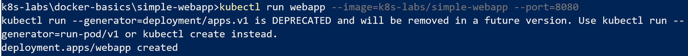
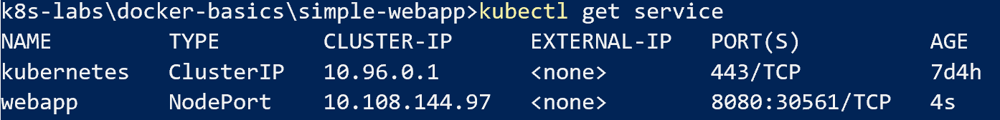

## Running a Docker image in Kubernetes

Use Docker for Desktop with Kubernetes (we are using the local Docker repository from the previous lab):

`kubectl run webapp --image=k8s-labs/simple-webapp --port=8080 --image-pull-policy=Never`

If we go to the browser now and enter url http://localhost:8080 we won't see the application.

That is because we need to expose the port to the 'outside' world first. Just like we did with Docker. (-p option)

`kubectl expose pod webapp --type=NodePort`

This will create an object of type Service in Kubernetes. The service runs the redirect of an external port xxxxx to the port of the webapp inside Kubernetes (port 8080). More on that in later labs.

We can look at the details via `kubectl get service`. That will show us the port redirect: 

Another way is via `kubectl describe service webapp`

Now we should be able to see our app at http://localhost:30561 (or whatever port is showing up at your machine)

If you want to debug locally we can also do port forwarding from localhost to some port inside the cluster.

`kubectl port-forward deployment/webapp 9000:8080`

When we stop this process, the forwarding is also terminated. So not really suitable for production, but could work nicely to develop or debug services.

In later labs we will work with some more mature networking in Kubernetes.
