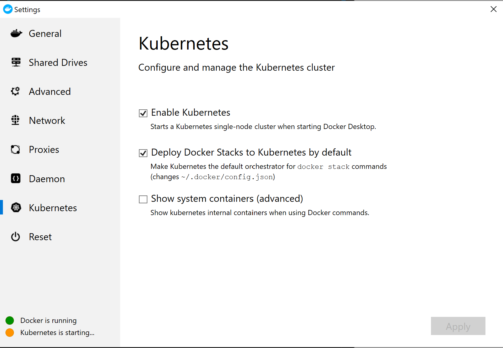
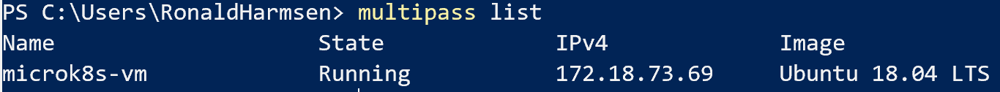

## Setting up your environment

#### Docker Desktop
Make sure you are running Docker Desktop on your machine.
If your haven't installed it before, download and install [Docker for Windows](https://docs.docker.com/docker-for-windows/install/) or [Docker for Mac](https://docs.docker.com/docker-for-mac/install)

#### Enable Kubernetes
Go to Docker settings and enable Kubernetes on Docker.

#### Install MicroK8s
Although you can run most of the labwork, installing a more complete Kubernetes environment makes live easier. And you can easily recreate/remove the lab-environment later.
To do that we use [MicroK8s](https://microk8s.io).

Download and install [Multipass](https://github.com/CanonicalLtd/multipass/releases/) first. Multipass lets you create and manage linux vm's quite easy.

After installing Multipass, create a VM like this:

`
multipass launch --name microk8s-vm --mem 4G --disk 40G
`

Then we want to run some snap commands to actually install MicroK8s into this VM.

`
multipass exec microk8s-vm -- sudo snap install microk8s --classic
`

And make sure networking allows us 'in'

`
multipass exec microk8s-vm -- sudo iptables -P FORWARD ACCEPT
`

Now we are ready to use the newly created Kubernetes environment inside the VM.
You can get the cluster info by executing:
`
multipass exec microk8s-vm -- /snap/bin/microk8s.kubectl cluster-info
`

You can get the ip-address of the VM running MicroK8s by running
`multipass list`, 
which will give you something like this:

Remember this command, as we need that IP address in later labs.